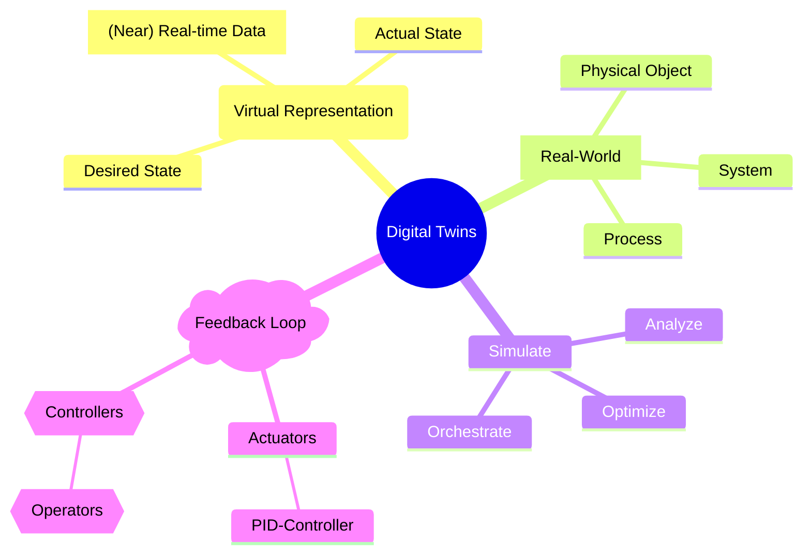

A **digital twin** is a virtual representation of a physical object, system, or process that is continuously updated with real-time or near-real-time data to mirror its real-world counterpart[^1].

This concept allows organizations to order, simulate, analyze, and optimize the real-world with its corresponding virtual map. Digital Twins are prevalent in the concept of Internet of Things (IoT) and used across industries like manufacturing, healthcare, urban planning, and automotive design to improve efficiency, predict failures, and enhance system performance.

The core value of digital twins lies in their ability to represent real-world data for use in orchestration and simulations, and enabling a feedback loop with actuators for control over complex systems.

<ApeiroImage>

</ApeiroImage>

[^1]: [Wikipedia: Digital Twin](https://en.wikipedia.org/wiki/Digital_twin)