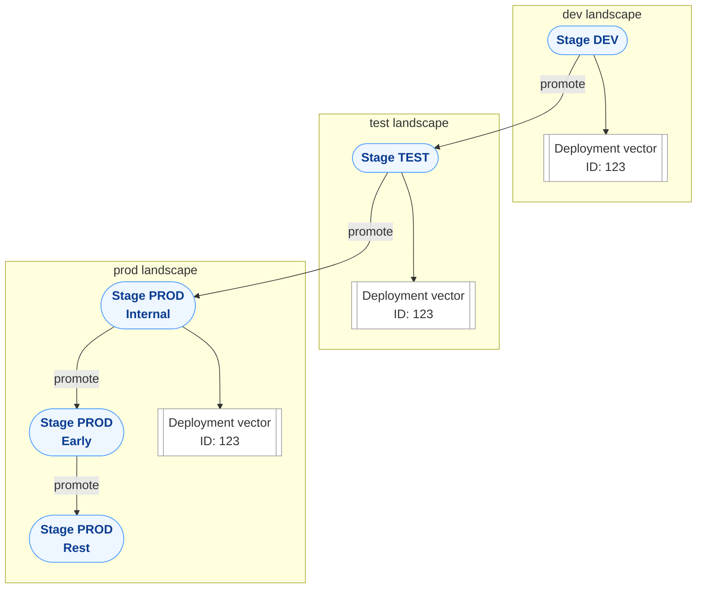

The following describes the core concepts of Konfidence.

## Artifact

An artifact is a versioned object produced during a build or continuous integration (CI) process.
When you use Konfidence, a build pipeline typically produces two outputs:

1. The build result, such as a Docker image, which is uploaded to a registry.

2. The Konfidence artifact, which contains a reference to that build result and additional metadata.

The artifact itself does not include the deployable content. Instead, it serves as a declarative reference to the build result, along with all the information required for consistent and reproducible deployments across environments.

## Vector

A vector is a complete specification of the desired application state. It is immutable and represents exactly one version of an application.

A vector contains only references to the required artifacts and their configurations.
Any change to an application creates a new vector, ensuring deployments are auditable, reproducible, and isolated from previous versions.

## Vector Deployment

A vector deployment is the explicit instruction to deploy a vector into a specific landscape. It includes the full deployment context, including the status of all referenced artifact deployments.

Vector deployments ensure that deployments are auditable, reproducible, and tightly coupled to the defined vector versions.

## Vector Deployment Usage

Vector deployment usage defines the lifecycle of a deployment. It determines whether a vector remains active or can be automatically removed, ensuring clean deployment management within a landscape.

## Stage

A stage is a defined step in the delivery process, such as build, test, or release. Stages function as conceptual checkpoints for quality assurance and approval.

In Konfidence, deployments are not executed directly in stages. Instead, they target landscape partitions, which represent the actual deployment destinations.

## Landscape

A landscape is the logical grouping of multiple stages and deployment targets within an enterprise environment. It provides a holistic view of systems, dependencies, and infrastructure components such as databases and routing infrastructure.

Landscapes enable consistent orchestration of deployments across all stages, from development through production. This structured approach minimizes deployment risks, standardizes processes, and provides the foundation for reliable, daily software deliveries.

