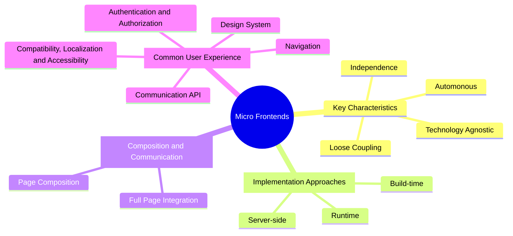

# Micro Frontends

<Term>Micro Frontends</Term> are an architectural pattern for web development[^thoughtworks] facilitating the integration of independently developed user interfaces of microservices components (often implemented with diverse technologies) into a streamlined and consistent, holistic graphical user interface. The reference architecture adopts the <Project name="openmfp">Open Micro Frontend Platform (OpenMFP)</Project>[^openmfp] as a key component to enable the integration of Micro Frontends into a single application.

## **Challenges** with Holistic User Interface Integration

Modern cloud environments are inherently complex, consisting of many services, each with its own user interface and UI technology frameworks. This diversity makes it difficult to coordinate guardrails for a consistent user experience across all moving parts, for both end-users and administrators. Micro Frontends together with a unified and extensible platform approach are crucial to address these challenges.

## Common Key Challenges

- **Redundant Implementations**: Common functions like authentication, authorization, and permissions are often independently developed by different teams, leading to duplication, increased complexity, and higher costs.
- **Integration Difficulties**: Services developed in isolation are difficult to integrate seamlessly, leading to delays, reduced reliability, and higher maintenance costs, which negatively impact efficiency.
- **Fragmented User Experience**: Users often need to navigate multiple interfaces, which hampers productivity, increases errors, and decreases user satisfaction.

## **Definition and Concept**

- Micro Frontends are analogous to microservices but applied to the frontend of web applications. They allow for the decomposition of a large frontend application into smaller, manageable parts, each responsible for a specific feature or function.
- Each Micro Frontend can be developed, tested, and deployed independently, enabling different teams to work on specific features without affecting the entire application.

## **Key Characteristics**

- **Independence**: Each Micro Frontend operates as a self-contained entity with its own codebase, dependencies, and deployment or lifecycle.
- **Technology Agnostic**: Teams can choose different technology stacks for each Micro Frontend, promoting flexibility and allowing for the use of the most suitable tools for each part of the application.
- **Autonomous**: Development teams can work autonomously, reducing coordination overhead and allowing for faster iterations, updates, and direct control over production.
- **Loose Coupling**: Micro Frontends are designed to be loosely coupled, meaning changes in one part of the application do not necessarily impact others, enhancing scalability and maintainability.

## **Implementation Approaches**

On a high level there are three common approaches to integrate Micro Frontends into a single application: [^mforg][^turing][^fowler]
- **Server-side Micro Frontend Integration**: In this integration approach, the server composes the Micro Frontends into a single page before sending it to the client.
- **Build-time Micro Frontend Integration**: In this approach, the Micro Frontends are built separately and then combined into a single application during the build process.
- **Runtime Micro Frontend Integration**: A central container application loads Micro Frontends dynamically at runtime, allowing for more flexibility and independence.

All above approaches can be used to implement a variation of a Micro Frontend architecture. Loading Micro Frontends at runtime is the preferred approach in ApeiroRA and combines the maximum flexibility with the highest independence.

## **Composition and Communication**

- **Full Page Integration**: The simplest approach, especially suited for more comprehensive applications, is to load a complete page, route or virtual routing tree from a single Micro Frontend. This approach typically integrates the Micro Frontend using an `iframe`. Benefits include improved isolation and a simpler development and deployment approach.
- **Page Composition using Web Components**: A more advanced approach is to compose a page from multiple Micro Frontends, each providing a set of web components. In this approach pages are structured by defining certain slots where web components can be loaded. This approach is more flexible and allows for fluent page compositions from various sources.

Both approaches are not mutually exclusive and can be combined to achieve the best possible balance between flexibility and simplicity. Typically, a Micro Frontend framework such as Luigi[^luigi] is used, that provides features for common challenges that arise when combining Micro Frontends to a single portal application.

## **Common User Experience and Look and Feel**

To achieve a consistent user experience it is recommended to establish common guardrails every integrated UI should follow. Depending on the degree of freedom that is given to teams that provide Micro Frontends these guardrails can be based on best practices and documentation or extend to reused style libraries and shared components and libraries.

It is recommended to cover at least these areas:
- **Design System**: A shared design system that defines the look and feel of the application, including theming, colors, typography, spacing, and other design elements. This may include a shared style and or component library. [^ui5w][^fundamentals][^fundamentalstyles]
- **Navigation**: A consistent navigation structure that allows users to move between different Micro Frontends seamlessly. This includes aligned intents for easy navigation across Micro Frontends.
- **Authentication and Authorization**: A unified approach to user authentication and authorization, ensuring that users have the appropriate access rights across all Micro Frontends and users are not required to log in multiple times.
- **Communication API**: In general communication between Micro Frontends should be minimal to avoid tight coupling. A common API should exist for common tasks like token refreshes, notifications, and other cross-cutting concerns.
- **Compatibility, Localization and Accessibility**: Ensure all Micro Frontends follow the same guardrails when it comes to Browser Support, Mobile Responsiveness, Localization and Accessibility.

<ApeiroImage>

</ApeiroImage>

[^openmfp]: [OpenMFP](http://openmfp.org/docs)
[^thoughtworks]: [Thoughtworks technology radar on Micro Frontends](https://www.thoughtworks.com/radar/techniques/micro-frontends)
[^mforg]: [Micro-Frontends.org](https://micro-frontends.org)
[^turing]: [What are Micro Frontends and When Should You Use Them?](https://www.turing.com/blog/micro-frontends-what-are-they-when-to-use-them)
[^fowler]: [Martin Fowler on Micro Frontends](https://martinfowler.com/articles/micro-frontends.html)
[^luigi]: [Project Luigi](https://luigi-project.io)
[^ui5w]: [UI5 Web Components](https://sap.github.io/ui5-webcomponents)
[^fundamentals]: [Fundamental Library](https://sap.github.io/fundamental/)
[^fundamentalstyles]: [Fundamental Library Styles](https://sap.github.io/fundamental-styles/)

