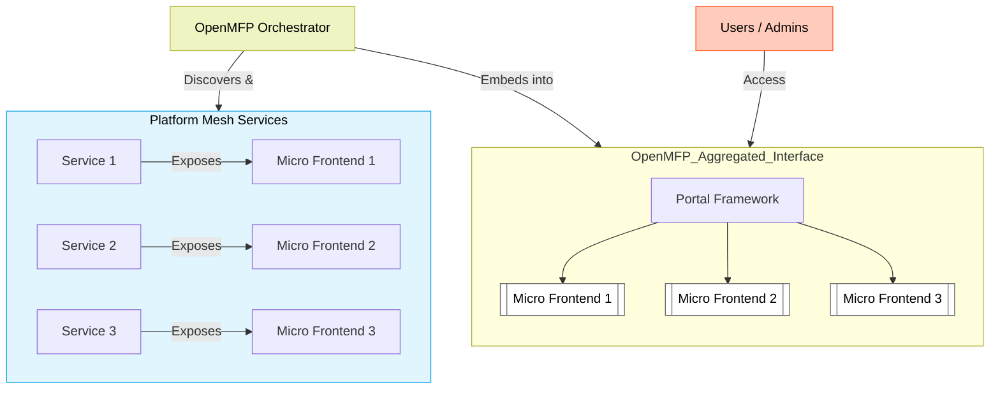
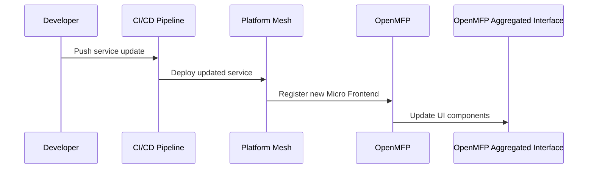
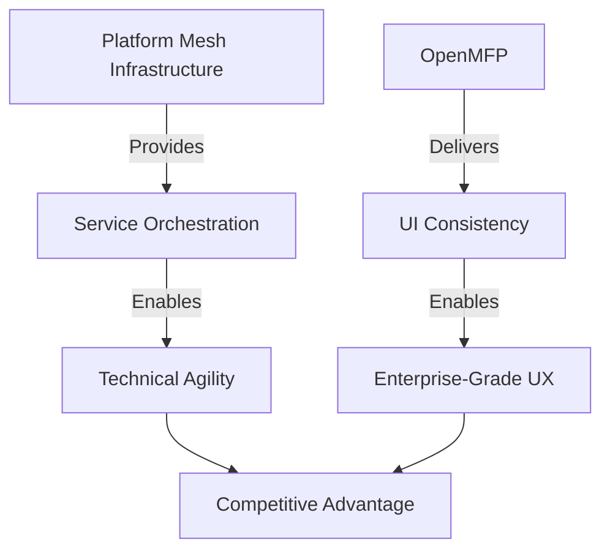

# Micro Frontends with OpenMFP

In the <Term>Platform Mesh</Term>, backend services are dynamically orchestrated, but their user interfaces often remain fragmented, creating disjointed experiences. <Project>OpenMFP</Project> addresses this by extending Platform Mesh principles to frontend components, creating a unified interface that evolves automatically with your infrastructure.

## How It Works

<ApeiroImage>

</ApeiroImage>

1. **Automatic UI Registration**: Services expose pre-configured Micro Frontends alongside their APIs.
2. **Dynamic Composition**: OpenMFP discovers and aggregates these UI components.
3. **OpenMFP Aggregated Interface**: Micro Frontends are embedded into portal framework slots while maintaining isolation.

## Key Advantages

### 1. Zero-Touch Integration
New services automatically appear in the portal with functional UI components, aligning frontend updates with backend deployments.

<ApeiroImage>

</ApeiroImage>

### 2. Consistent Governance
Enforce security policies, design systems, and accessibility standards across all Micro Frontends.

### 3. Context-Aware Composition
UI components dynamically adapt based on user roles, runtime environment, and service dependencies.

## Benefits for Different Stakeholders

```mermaid
flowchart LR
    subgraph Stakeholders["Key Benefits by Role"]
        direction TB
        
        subgraph Dev[Developers]
            direction TB
            D1[🛠️ Independent Deployment] --> D2[⚡ Faster Iterations]
            D2 --> D3[🧩 Reusable Components]
        end

        subgraph Ops[Operations]
            direction TB
            O1[🔍 Unified Monitoring] --> O2[⚙️ Consistent Governance]
            O2 --> O3[📈 Simplified Scaling]
        end

        subgraph Business["Business Leaders"]
            direction TB
            B1[🚀 Faster Time-to-Market] --> B2[💸 Reduced Costs]
            B2 --> B3[📊 Better Insights]
        end

        subgraph Users["End Users"]
            direction TB
            U1[🎯 Unified Experience] --> U2[⏱️ Instant Updates]
            U2 --> U3[🔗 Context-Aware UI]
        end
    end

    classDef role fill:#f5f5f5,stroke:#666,stroke-width:1px,color:#000000
    classDef dev fill:#e3f2fd,stroke:#2196f3,color:#000000
    classDef ops fill:#f0f4c3,stroke:#cddc39,color:#000000
    classDef biz fill:#c8e6c9,stroke:#4caf50,color:#000000
    classDef user fill:#ffebee,stroke:#ef5350,color:#000000

    class Dev dev
    class Ops ops
    class Business biz
    class Users user
    class Stakeholders role
```

<ApeiroImage>

</ApeiroImage>

## Why This Matters

Modern cloud platforms face a critical challenge: backend innovation often outpaces frontend integration. OpenMFP resolves this by:

1. **Bridging the UI Gap**: Aligning frontend development with backend service delivery.
2. **Preserving Architectural Integrity**: Maintaining loose coupling while delivering cohesive experiences.
3. **Future-Proofing Investments**: Supporting evolving UI frameworks without platform rewrites.

OpenMFP enables organizations to achieve _continuous interface cohesion_ - the missing link in cloud-native architectures. This approach delivers:

- **Operational Symbiosis**: Frontend/backend lifecycle synchronization at enterprise scale.
- **Innovation Amplification**: Autonomous teams shipping features that enhance collective capabilities.
- **Experience Sovereignty**: Full control over user journeys without sacrificing developer freedom.

<ApeiroImage>

</ApeiroImage>

In an era where user experience defines competitive advantage, OpenMFP transforms distributed systems management from a technical challenge into a strategic differentiator. Teams innovate freely at the edge while the platform ensures every component strengthens the whole - exactly as cloud-native architecture intended.
