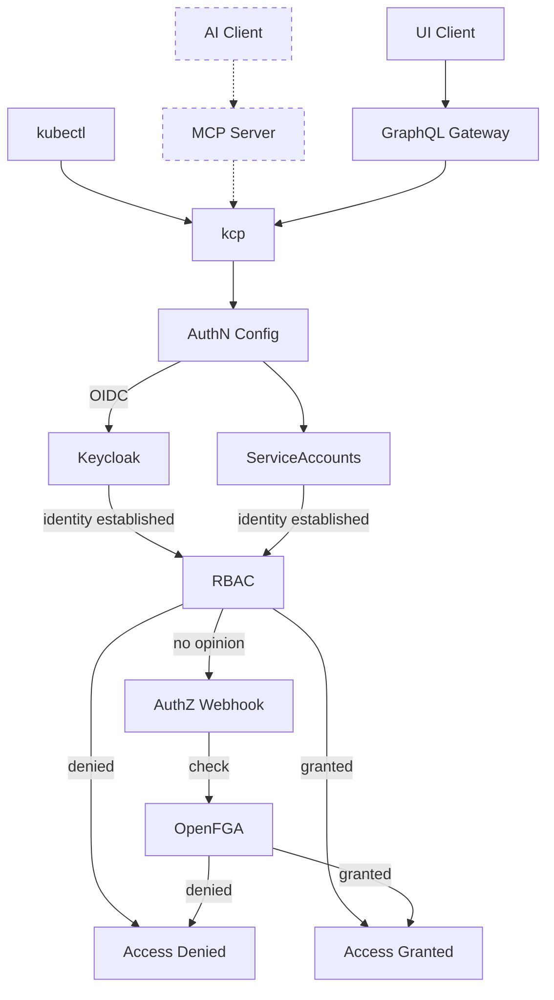

Securing a distributed, multi-tenant platform that spans organizational boundaries requires a deliberate architectural approach.
Traditional monolithic security models, where authentication and authorization are tightly coupled within a single system, fail to address the dynamic nature of service ecosystems where <Term>service providers</Term>, <Term>service consumers</Term>, and marketplace operators interact across isolated <Term>control planes</Term>.

Platform Mesh addresses this challenge through a clear separation of authentication and authorization as independent architectural concerns, each implemented by purpose-built components that can evolve, scale, and be replaced independently.
This design aligns directly with the [decoupling principle](./guiding-principles.md) that guides the overall architecture: security subsystems, like all other components, should be directly usable without requiring the complete framework.

Platform Mesh is accessed through multiple client types, each with distinct interaction patterns.
UI clients interact through a Kubernetes-GraphQL-Gateway, `kubectl` users communicate directly with <Project>kcp</Project> via the KRM API, and AI agents are expected to interact through a dedicated MCP (Model Context Protocol) server[^1].
Regardless of the client type, all requests ultimately reach <Project>kcp</Project>, where the same authentication and authorization mechanisms apply uniformly.

[^1]: The MCP server for Platform Mesh is a planned future component.

## Authentication

Authentication in Platform Mesh establishes a verified identity for every interaction, whether initiated by a human user, an automated pipeline, or a service-to-service call.
The platform standardizes on **OpenID Connect (OIDC)** as the primary authentication protocol, providing a consistent, token-based identity layer across all participants in the mesh.
In addition, <Project>kcp</Project> natively supports Kubernetes service accounts, enabling workloads and automation to authenticate directly without requiring an external identity provider.

Keycloak is configured as an OIDC provider through <Project>kcp</Project>'s **authentication configuration** mechanism, the same declarative approach used to configure any OIDC-compatible identity provider.
For user-facing identity providers, Keycloak acts as the federation layer through its identity brokering mechanism.
For machine identity issuers, such as Kubernetes cluster JWT issuers or GitHub Actions OIDC, where identity brokering through Keycloak does not apply, <Project>kcp</Project>'s support for OIDC configuration at the workspace level enables direct integration at the account level.
This ensures that the authentication layer is not hardwired to a single provider or federation path but rather configured through standard Kubernetes primitives.

### Internal Identity Provider

Keycloak[^2] serves as the internal Identity Provider (IDP) within Platform Mesh and Apeiro.
As a centralized identity and access management solution implementing OIDC, OAuth 2.0, and SAML 2.0, Keycloak provides the authentication surface through which all platform interactions are verified.

Key aspects of Keycloak's role within Platform Mesh:

- **Token-Based Identity:** Keycloak issues JWT-based access tokens, ID tokens, and refresh tokens following OIDC standards. These tokens carry identity claims that downstream services consume to establish the caller's identity without repeated authentication.
- **Authentication Flows:** Platform Mesh leverages Keycloak's support for standard OIDC flows. The portal uses the Authorization Code grant for interactive browser sessions, while `kubectl` uses the Authorization Code grant with PKCE (Proof Key for Code Exchange) as a public client against <Project>kcp</Project>.
- **Tenant-Aligned Realms:** Platform Mesh creates a dedicated Keycloak realm per organization, providing isolated user stores, client configurations, and authentication policies that align with the hierarchical <Term>account model</Term>.

### Identity Federation

A critical requirement for any platform operating across organizational boundaries is the ability to integrate with existing identity infrastructure.
As noted in the [Operator Perspective](./perspectives/operator-perspective.md), Apeiro supports connecting one or more OpenID Connect-compatible identity providers but does not prescribe a single provider.

Keycloak addresses this through its identity brokering mechanism.
External identity providers (corporate OIDC providers, SAML identity providers, LDAP directories) can be connected as federated sources.
Users authenticate against their existing corporate IDP, and Keycloak translates the external identity into a consistent internal representation, ensuring that downstream authorization decisions operate on a normalized identity regardless of the authentication source.

This approach enables the "bring your own IDP" model essential for multi-organizational service ecosystems while maintaining a uniform authentication contract across the mesh.

## Authorization

Once an identity is established, Platform Mesh must determine what that identity is permitted to do.
Given the complexity of interactions across hierarchical accounts, <Term>service providers</Term>, and <Term>service consumers</Term>, Platform Mesh supports a **two-tier authorization model**: Kubernetes RBAC for control-plane-local decisions and OpenFGA for authorization across control plane boundaries.

### Kubernetes-Native RBAC

The first tier leverages the built-in Role-Based Access Control[^5] mechanism of Kubernetes.
Since the Platform Mesh API layer is built on the <Term>Kubernetes Resource Model</Term> and powered by <Project>kcp</Project>, RBAC is the natural structural access control layer.

Kubernetes RBAC operates at the API resource level, governing which subjects (users, groups, service accounts) can perform which verbs (get, list, create, update, delete) on which resource types within a given workspace.
Each account functions as an isolated <Term>control plane</Term> with its own RBAC configuration, meaning access policies are always scoped to the control plane they are defined in.
RBAC rules are themselves Kubernetes resources, managed declaratively through the same KRM patterns used for all platform resources, consistent with the [declarative API principle](./guiding-principles.md).
This extends naturally to Custom Resource Definitions introduced by <Term>Managed Service Providers</Term>: when a service provider exposes new <Term>capabilities</Term>, the existing RBAC mechanism governs access without additional configuration.

### Fine-Grained Authorization with ReBAC

The second tier addresses authorization decisions that go beyond what RBAC can express: decisions that depend on relationships between entities such as team memberships, resource ownership, or service subscriptions.

OpenFGA[^3] provides **Relationship-Based Access Control (ReBAC)**, an authorization model based on the Zanzibar approach[^4], where access decisions are derived from a graph of relationships rather than static role assignments.
Authorization state is expressed as relationship tuples, (user, relation, object), and permissions propagate through the graph.
For example, if a team has ordered a service and a user is a member of that team, the user inherits access to that service instance without explicit per-user permission grants.

The hierarchical <Term>account model</Term> maps naturally to this relationship graph, and permissions defined at a parent account can flow to child accounts through relationship inheritance.
Resources from different <Term>service providers</Term> are represented as distinct resource types in <Project>kcp</Project>, and access to each is evaluated through the standard SubjectAccessReview mechanism regardless of the provider origin.

### Layered Evaluation

Kubernetes RBAC serves as the first gate, enforcing structural access at the API level.
When RBAC can make a definitive decision (granting or denying access based on resource-type permissions), the request is resolved immediately.
When RBAC has no opinion, typically for fine-grained access decisions that depend on relationships rather than resource types, the request is forwarded to OpenFGA through the authorization webhook for relationship-based evaluation.

OpenFGA is integrated through <Project>kcp</Project>'s standard **authorization webhook** mechanism.
This means that OpenFGA is not a hardwired component: any authorizer conforming to the Kubernetes authorization webhook interface can be configured as an alternative or additional authorization backend, preserving the platform's commitment to pluggability and decoupling.

## Separation of Concerns

Authentication and authorization are independent subsystems, reflecting Platform Mesh [guiding principles](./guiding-principles.md).
The two are connected solely through the OIDC token: authentication produces it, authorization consumes the identity claims within it.
While OIDC tokens carry claims such as group memberships that inform RBAC decisions, the token should establish _who_ the caller is, not _what_ they are allowed to do -- encoding permissions as group claims is an anti-pattern that blurs this boundary.
They share no other state, meaning each can evolve, scale, and be replaced independently.
Both are integrated through standard Kubernetes extension points (authentication configurations for identity providers and authorization webhooks for authorizers), enabling alternative implementations that satisfy the same interfaces.

However, Platform Mesh provides specific integration with Keycloak and OpenFGA, such as per-organization realm and store provisioning, identity brokering configuration, and dynamic authorization schema generation.
Replacing either component with an alternative would require reimplementing these integration aspects.

## Integration with the Account Model

The security architecture integrates deeply with Platform Mesh [Account Model](./account-model.md), ensuring that security boundaries align with organizational boundaries throughout the hierarchy.

- **Per-Organization Identity Realm:** Platform Mesh creates a dedicated Keycloak realm for each organization, providing complete isolation of user stores, client configurations, and authentication policies. This realm is configured as an OIDC provider through <Project>kcp</Project>'s authentication configuration, tying the organization's identity management directly to its account hierarchy.
- **Per-Organization FGA Store:** Similarly, each organization receives a dedicated OpenFGA store, isolating authorization state across organizational boundaries. This ensures that relationship tuples and authorization evaluations for one organization cannot interfere with another.
- **Dynamic Authorization Schema:** Platform Mesh dynamically generates the OpenFGA authorization schema for each organization based on the APIs bound within that organization's accounts. As <Term>service providers</Term> expose new <Term>capabilities</Term> and consumers bind to them, the authorization model automatically evolves to include the corresponding types and relations, eliminating the need for manual schema maintenance.
- **Hierarchical Inheritance:** OpenFGA relationship tuples can be inherited through the account hierarchy. Permissions defined at a parent account can propagate to child accounts through the relationship graph, simplifying governance while allowing overrides where organizational requirements demand it.
- **Service Relationship Authorization:** When <Term>service consumers</Term> engage with <Term>service providers</Term> through the export and bind mechanisms of the account model, the authorization layer automatically reflects these relationships. OpenFGA also controls where in the account hierarchy a provider's service can be bound, ensuring that service consumption is constrained to the appropriate organizational scope.
- **Marketplace Integration:** When a provider API is activated through a <Term>marketplace</Term>, the OpenFGA authorization schema for the organization is extended to include the corresponding resource types and relations, making the new service's resources available for fine-grained authorization decisions.

:::info NOTE
Platform Mesh security architecture represents ongoing research in distributed authorization patterns.
The model continues to evolve to support enhanced cross-provider authorization scenarios, relationship-based authorization model management, and advanced authorization propagation across the account hierarchy.
:::

Platform Mesh security architecture builds on <Project>kcp</Project>'s own security foundations, including workspace isolation, APIExport identity, and permission claims.
For a detailed analysis of these foundations, see the [kcp Security Self-Assessment](https://docs.kcp.io/kcp/v0.30/contributing/governance/security-self-assessment/) (particularly the [Security Functions and Features](https://docs.kcp.io/kcp/v0.30/contributing/governance/security-self-assessment/#security-functions-and-features) section) and the [security section of kcp's General Technical Review](https://docs.kcp.io/kcp/v0.30/contributing/governance/general-technical-review/#security).

[^2]: [Keycloak](https://www.keycloak.org/)
[^3]: [OpenFGA](https://openfga.dev/)
[^4]: [Zanzibar: Google's Consistent, Global Authorization System](https://research.google/pubs/zanzibar-googles-consistent-global-authorization-system/)
[^5]: [Kubernetes RBAC Documentation](https://kubernetes.io/docs/reference/access-authn-authz/rbac/)
